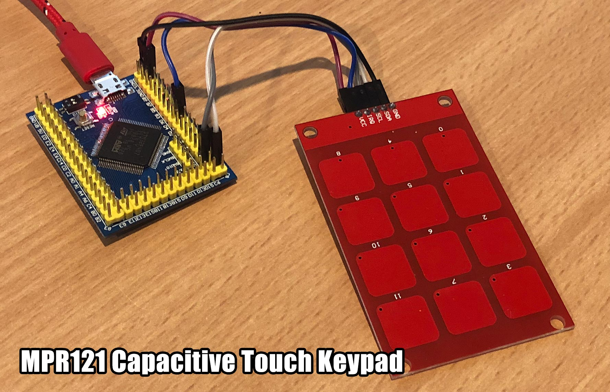

# MicroPython MPR121

MicroPython driver for MPR121 capacitive touch keypads and breakout boards.




Compatible with:
* [SparkFun Capacitive Touch Keypad - MPR121](https://www.sparkfun.com/products/12017) (discontinued)
* [MPR121 Capacitive Touch Keypad](https://www.aliexpress.com/item/MPR121-capacitive-touch-sensor-module-sensor-keys-keyboard-keys-for-arduino/32810655083.html)
* [MPR121 Capacitive Touch Breakout Board](https://www.aliexpress.com/item/MPR121-Breakout-V12-Capacitive-Touch-Sensor-Controller-Module-I2C-keyboard/32820571887.html)

These boards use 3.3V logic, so you would want to use a logic level converter with this for 5V systems.

## Examples

Copy the file to your device, using ampy, webrepl or compiling and deploying. eg.

```bash
$ ampy put mpr121.py
```

**Basic usage**

```python
from machine import Pin, I2C
import mpr121
import time

i2c = I2C(scl=Pin(5), sda=Pin(4))
mpr = mpr121.MPR121(i2c, 0x5A)

while True:
	print(mpr.touched())
	time.sleep_ms(100)
```

For more detailed examples, see [/examples](/examples)

## Parts

* [MPR121 Capacitive Touch Keypad](https://www.aliexpress.com/item/MPR121-capacitive-touch-sensor-module-sensor-keys-keyboard-keys-for-arduino/32810655083.html) $2.88 AUD
* [Female-Female Dupont wires](https://www.aliexpress.com/item/10pcs-10cm-2-54mm-1p-1p-Pin-Male-to-Male-Color-Breadboard-Cable-Jump-Wire-Jumper/32636873838.html) $0.64 AUD
* [VCC-GND STM32F407VET6 mini](https://www.aliexpress.com/item/STM32F407VET6-Mini-version-of-the-core-board-STM32-minimum-system-version/32709285751.html) $15.47 AUD
* [TinyPICO](https://www.tinypico.com/) $20.00 USD
* [Wemos D1 Mini](https://www.aliexpress.com/item/32529101036.html) $5.20 AUD

## Connections

### VCC GND STM32F407VET6 Mini

```python
from machine import I2C
import mpr121
i2c = I2C(3)
mpr = mpr121.MPR121(i2c, 0x5A)
```

MPR121 | STM32F407VET6
------ | -------------
VCC    | 3V3 (or 5V)
IRQ    | D3 (optional)
SCL    | A8 (SCL)
SDA    | C9 (SDA)
GND    | GND

* I2C(1) SCL=B6, SDA=B7
* I2C(2) SCL=B10, SDA=B11
* I2C(3) SCL=A8, SDA=C9

### TinyPICO (ESP32)

```python
from machine import Pin, I2C
import mpr121
i2c = I2C(scl=Pin(22), sda=Pin(21))
mpr = mpr121.MPR121(i2c, 0x5A)
```

MPR121 | TinyPICO ESP32
------ | -------------
VCC    | 3V3
IRQ    | GPIO32 (optional)
SCL    | GPIO22 (SCL)
SDA    | GPIO21 (SDA)
GND    | GND

### Wemos D1 Mini (ESP8266)

```python
from machine import Pin, I2C
import mpr121
i2c = I2C(scl=Pin(5), sda=Pin(4))
mpr = mpr121.MPR121(i2c, 0x5A)
```

MPR121 | D1 Mini ESP8266
------ | -------------
VCC    | 3V3
IRQ    | D3 (optional)
SCL    | D1 GPIO5 (SCL)
SDA    | D3 GPIO4 (SDA)
GND    | GND

## Links

* [micropython.org](http://micropython.org)
* [MPR121 datasheet](http://micropython.org/resources/datasheets/MPR121.pdf)
* [MPR121 product page](https://www.nxp.com/products/no-longer-manufactured/proximity-capacitive-touch-sensor-controller:MPR121)
* [Adafruit Ampy](https://learn.adafruit.com/micropython-basics-load-files-and-run-code/install-ampy)

## License

Licensed under the [MIT License](http://opensource.org/licenses/MIT).

Copyright (c) 2018 Mike Causer
